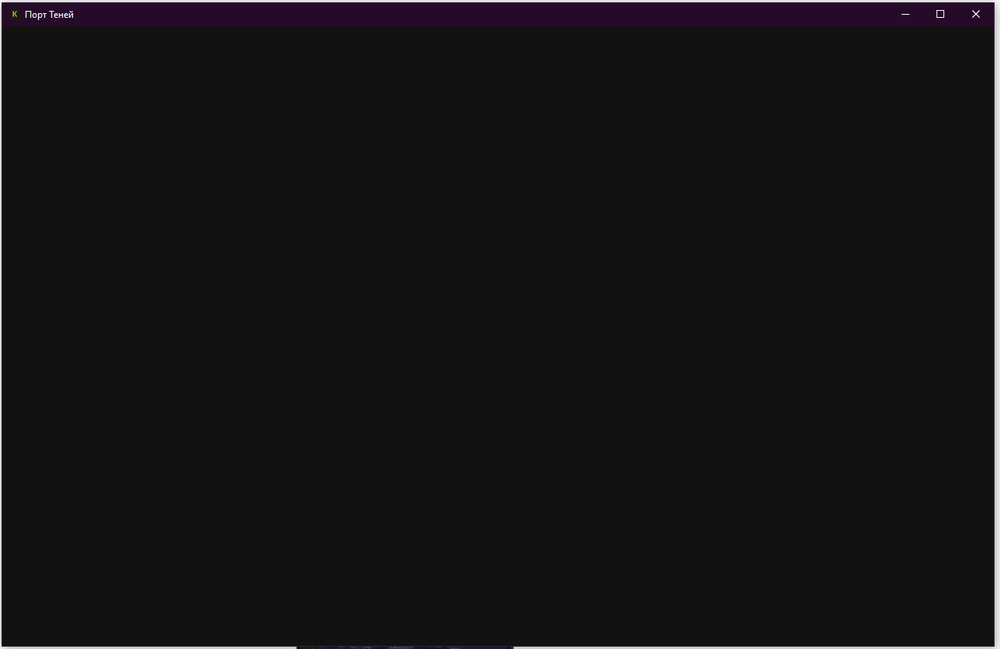

# Прогон 002 — запуск ПК-приложения, 08.10.2026

Сообщение автора: «приложение на пк не открывается». Установленная оболочка 0.1.0; опубликованная игра обновлена до интерфейса 9c8bf27. Точный номер установленной игровой страницы неизвестен: окно не загружает её.

Наблюдение: окно «Порт Теней» создаётся, вся клиентская область пустая и тёмная. Маршрута внутри игры нет — остановка до появления первого экрана.

## Разбор

Навигационный фильтр Rust сравнивал `Url::path()` с буквальным `/Игра/Порт/`. Разобранный URL содержит percent-encoded путь, поэтому фильтр отвергал стартовый адрес. Исправление: 7d1ba6c9c84228a6672fa2faaad821a40d7a443f, оболочка 0.1.1; сравниваются два разобранных URL, включая схему, хост, порт и путь. IPC-доступ удалённой игры по-прежнему выключен.

[PR002-01](../РЕЕСТР.md#pr002-01). Rust-тесты и установщик собираются в [GitHub Actions](https://github.com/kastartorij-dot/kordim/actions/runs/37693558173). Установка и визуальная проверка в приложении ещё не подтверждены.

Локально publish-all/check успешны (202 файла), из 19 скриптов 17 успешны. Прежние остановки: сверка-этапа-4 и повариха в шаг5.

## Повторная проверка сборки и установка

08.10.2026: GitHub Actions run 37693558173 завершён успешно. Rust-тесты навигации прошли, установщик «Порт Теней_0.1.1_x64-setup.exe» собран. Установлен на этом ПК поверх 0.1.0 с кодом выхода 0; EXE обновлён (4142592 байта), приложение запущено. Профиль не удалялся. Визуальный результат и доступность прежнего сейва ожидают подтверждения автора: native UI недоступен инструменту этой сессии. Статус PR002-01 остаётся «Исправлено, ждёт проверки».

Автор подтвердил повторный запуск: «Да, игра открылась». Версия установленного EXE проверена через ProductVersion: 0.1.1. Пустое окно устранено. Наличие и загрузка прежней партии отдельно не подтверждались.

## Размер меню

После запуска автор прислал [меню-карточку](меню-карточка.png) и [игру на всё окно](игра-всё-окно.png): «открылось но меню не на весь экран», «а игра на весь». Исправлено растягивание сценического фона главного меню и паузы на клиентскую область; проверка браузером 1280×720. [Результат](../../Разработка/Шаг_14_Арт_тексты_удобство/Визуал_07_10/Внедрение_08_10/README.md#уточнение-меню-после-пк-прогона).

## План дома и метки районов

Автор: «фу а это что так некрасиво? давай сделаем красиво, с картинками» — [план до изменения](план-до.png). Отдельно: «когда наводишь на любой район и нажмиаешь на него он както странно дрыгается в сторону. пофикси» — [метка района](метка-района.png).

Разбор: план использовал старые mroom-ячейки с тяжёлыми рамками; фоновых иллюстраций в плане не было. Метка позиционируется translate(-50%,-50%), но общий .b:active сбрасывал transform. Исправления 8df1323f3f0e12aee0a0b5433c4e876f76ed8139: план с существующим артом шести помещений и этажами; отдельные состояния и цены без раскрытия скрытых названий. Метки сохраняют transform при hover/active/focus; при выборе района обновляется правая карточка, изображение и метки остаются в DOM. У изображения карты заданы реальные размеры; отключена привязка прокрутки.

[PR002-02](../РЕЕСТР.md#pr002-02), [PR002-03](../РЕЕСТР.md#pr002-03). Браузер: шесть изображений загрузились, Escape возвращает фокус; на 390×844 ширина страницы 390. Обычный щелчок по метке Трущоб: x=625.21875, y=501.546875 и scrollTop=58 одинаковы до/после; выбор не меняет день, деньги и текущий район. [Снимки результата](../../Разработка/Шаг_14_Арт_тексты_удобство/Визуал_07_10/Внедрение_08_10/README.md).
