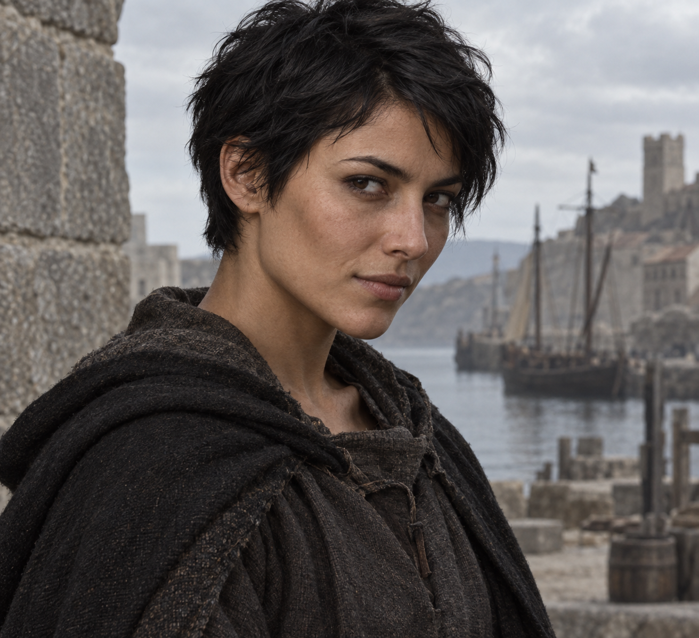

# НПС-кандидатка — Нэра (временное имя)

**Статус на 28.09.2026:** автор выбрал **весь портрет** как внешний образ потенциального НПС. Имя, занятие, характер и история ниже — пробный черновик, не утверждённый канон мира.

## Внешность по утверждённому портрету

Молодая женщина с короткими чёрными волосами, подстриженными почти по-мальчишески. Смугловатая кожа, тёмные глаза, прямой нос, чёткие скулы. На ней простая тёмная одежда и грубый плащ. Стоит у каменной стены на фоне гавани; взгляд внимательный, с едва заметной усмешкой. Сохранять **изображение целиком**, включая одежду, позу и окружение, без обрезки до лица.

## Пробная история

Нэра выросла рядом с причалами Порта Теней. Её мать чинила сети, а она с детства носила по гавани записки и мелкие заказы: от мастерской к лодочникам, от лодочников к торговым рядам. Теперь её нанимают на день, когда нужен человек, который знает порт и умеет найти того, кто не сидит на месте.

Однажды после непогоды Нэра нашла лодку, которую уже сочли пропавшей, в тихой бухте за мысом. С тех пор к ней чаще обращаются с поручениями, где важнее внимательность, чем сила. Она берётся не за каждое: если ей не объясняют, кому предназначена передача, сначала задаёт вопросы. Это не громкий принцип, а привычка человека, которому потом самому идти по тем же улицам.

В разговоре Нэра держится легко, иногда чуть насмешливо. Она не любит рассказывать о себе незнакомым, зато помнит, кто обещал вернуться за ответом. Это пока лишь возможный характер для выбранного лица; его можно полностью заменить.

## Открыто для решения автора

- Оставить ли имя «Нэра» и работу портовой посыльной.
- Сохранить ли Порт Теней как её город: порт на изображении может быть и другим.
- Нужна ли ей связь с какой-либо сюжетной линией или она останется местной знакомой без большого секрета.
