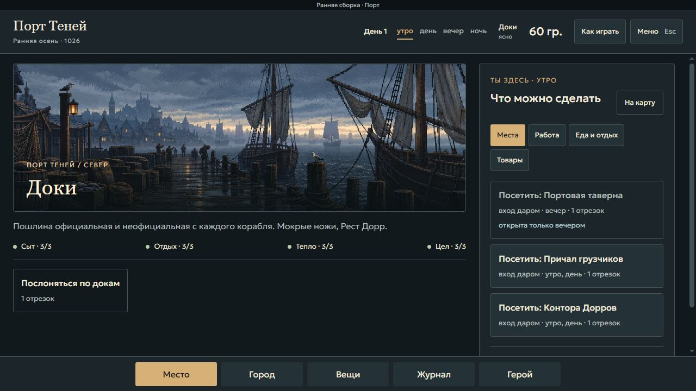
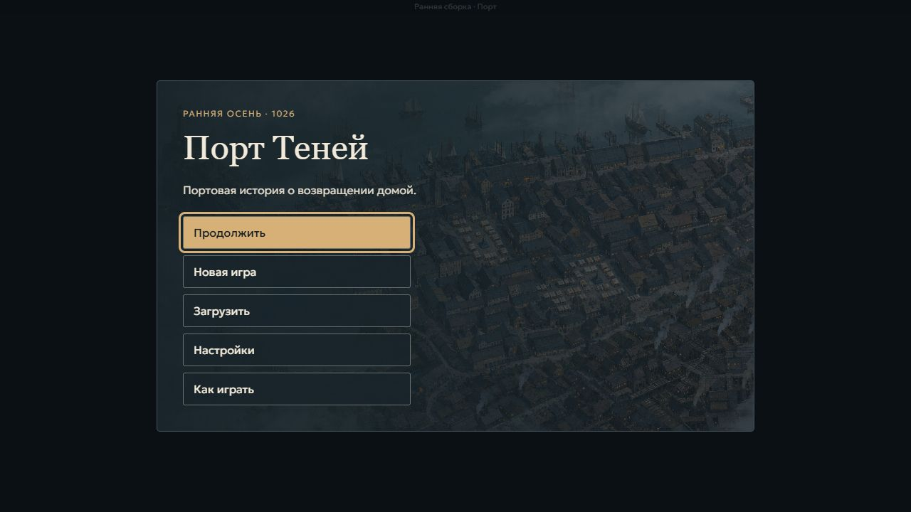
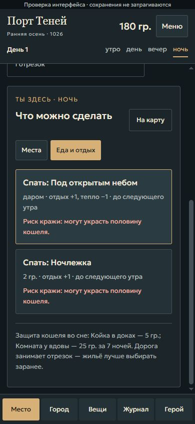

# Внедрение «Портовой хроники» — 08.10.2026

Автор утвердил макет: «охуенно. внедряй». Интерфейс внедрён в действующую игру. Коммит реализации: dea7118ce4312748ac8ddd05e4735f56faed8036. Сохранения остаются версии 12.

## Что изменилось

- Главное и пауза-меню: продолжение, отдельные сохранения, настройки, помощь; игровые подтверждения с отменой по Escape. Повреждённый автосейв резервируется перед новой игрой; ручные слоты сохраняются.
- Верхняя строка показывает день, четыре отрезка, место и деньги. Постоянная навигация: место, город, вещи, журнал, герой. Убрана пустая боковая полоса.
- Район: иллюстрация и группы действий. Подписи показывают действующие цены и время, различают посещение и сон. Выбор на карте бесплатен; дорога требует отдельного действия.
- Сумка: восемь ячеек с учётом ран, больших вещей и стопок; описание и действия выбранной вещи. Внешнее хранение, залоги и ожидающие награды сохранены.
- Журнал: дела, знания, люди, дни. Завершённые дела отделены от текущих; сроки, истинность знаний, возможность передачи, долги и причины изменений доступны.
- Разговоры: области сцены, реплики и ответов; сворачиваемые знания, причины недоступности выбора. При отсутствии отдельного фона явно подписана панорама района; отсутствующий портрет заменён инициалами.
- Крупный текст, высокий контраст и уменьшение движения сохраняются отдельно от сейва. Tab обходит элементы активного окна; Escape закрывает верхнее разрешённое окно и возвращает фокус. Обязательные результаты не пропускаются.
- Адаптация для телефона и короткого iframe. Исправлена горизонтальная прокрутка страницы игры на сайте, рамка и панель запуска приведены к новому оформлению.
- Windows-сборка: при EPERM/EBUSY переименования подготовленной копии используется копирование с восстановлением прежней публикации при ошибке.

## Проверка

| Проверка | Результат |
|---|---|
| npm run publish-all | Успешно: ПОРТ и Хроники |
| npm run check | Успешно: 202 файла ПОРТа и Хроники синхронны |
| Все 19 скриптов Тесты/*.mjs, включая генератор текстов | 17 успешны; две прежние остановки указаны ниже |
| Синтаксис изменённых JS и встроенного скрипта index.html | Успешно |
| Новый интерфейс.mjs | 40 состояний: цены, время, риск, полнота категорий, отсутствие мутации при просмотре; резерв повреждённого автосейва |
| Браузер: 1280×720 и 390×844 | Главное меню, начало/продолжение, сохранение/загрузка, карта, сумка, журнал, разговор, ночь, настройки, фокус/Tab/Escape |
| Опубликованная копия внутри сайта, локально | Нет горизонтального переполнения на телефоне; текст и нижняя навигация доступны |

Прежние ошибки: `сверка-этапа-4.mjs` сверяет поздние темы со старым заданием; `шаг5.mjs` останавливается на «повариха узнаёт своего в настоящей сцене». Полностью зелёный набор не заявляется.

В браузере дополнительно проверены: выбор района без списания денег/времени; бинты ×3 → ×2 с лечением и обновлением вместимости; цифровые ответы блокируются открытым журналом; отмена новой игры сохраняет состояние; вложенное меню поверх журнала закрывается отдельно; обязательный итог дня не закрывается Escape; 24 темы на телефоне остаются внутри прокручиваемой области. Настройки переживают перезагрузку.

Для воспроизводимых состояний есть [страница проверки](../../../../../Тесты/интерфейс.html) и [фикстуры](../../../../../Тесты/интерфейс-фикстуры.js). Они не читают и не записывают игровые сохранения. Адрес: `Тесты/интерфейс.html?кейс=вещи`; другие кейсы: `полная-сумка`, `журнал`, `ночь`, `ночлежка`, `разговор`, `темы`. Настройки интерфейса общие с игрой.

## Замечания и границы

[PR001-09](../../../../Прогоны/РЕЕСТР.md#pr001-09) проверено: перед оплатой 2 гр. виден риск потери половины кошеля и безопасное жильё за 5 гр. либо 25 гр. за неделю. Предупреждение получено из действующих данных жилья. Скриншот ниже снят на странице проверки настоящего интерфейса.

[PR001-02](../../../../Прогоны/РЕЕСТР.md#pr001-02) в работе: явное время, «Посетить»/«Спать», подпись сна до следующего утра и предупреждение о ночном визите внедрены. Полная приёмка ждёт исправления [PR001-01](../../../../Прогоны/РЕЕСТР.md#pr001-01): ночной вход ещё преждевременно меняет день. Игровая основа этой ошибки в рамках оформления не изменена.

32 ранее подготовленные иллюстрации работ, быта и города остаются отдельным заданием подключения. Чистовая приёмка всего шага 14 не объявляется завершённой.

## Снимки внедрённого интерфейса

## Уточнение меню после ПК-прогона

08.10.2026: автор отметил, что игра занимает окно, а главное меню остаётся центральной карточкой. Главное меню и пауза со сценическим фоном растянуты на всю клиентскую область; кнопки сохраняют удобную ширину. Настройки, сохранения и помощь остаются отдельными окнами. В браузере фон занимает ровно 1280×720 с началом в (0,0); переход в настройки и назад проверен. Сборка/check успешны, 17/19 скриптов проходят, две прежние ошибки без изменений. [Снимок](меню-всё-окно.png).
